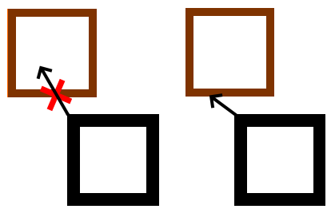
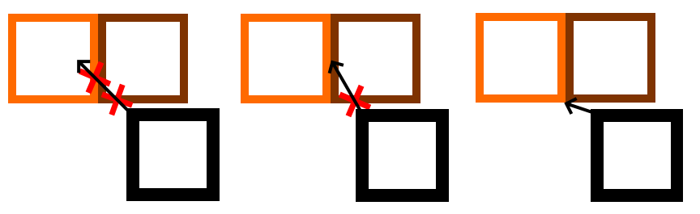
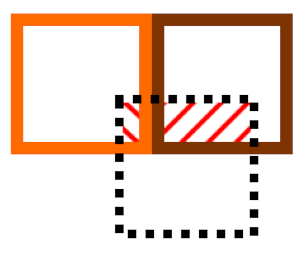

# Game project

Created by ***Eric Jansson***

## Brief description

This project was initially created to explore unit 
collision. It evolved into adapting to that collision 
and from there I kept finding new ways to improve the game.

## Controls

W,A,S,D &nbsp;- &nbsp; Move\
Space &nbsp;&nbsp;&nbsp; - &nbsp; Dash\
P &nbsp; &nbsp; &nbsp; &nbsp; &nbsp; &nbsp; - &nbsp; Pause\
Escape &nbsp; - &nbsp; Quit

<u>**Debugging**</u>\
L &nbsp; - &nbsp; Print player's current: coordinate position, direction, velocity and tile position\
T &nbsp; - &nbsp; Move camera to predetermined position\
Y &nbsp; - &nbsp; Focus camera on another entity\
F &nbsp; - &nbsp; Upgrade movement (Walk -> Walk + Swim -> Fly -> Walk...)

## Interesting problems

#### Collision

Collision is calculated using 2 matrices and checking where 
they overlap. To see if an entity is about to collide with
something, the velocity vector is added to the entity matrix and
compared with the obstacle's matrix. The velocity vector is then adjusted so
the two matrices are no longer overlapping.

#### Collision direction

To know whether we are running into an obstacle from the side or top/down,
I used the deltaX and deltaY from the collision. By using that to calculate
the ratio between deltaX and velocity.x (and the same for Y) then I can compare
the two. If the X-ratio would be smaller than the Y-ratio, then we know we're colliding
from the side and the X value must be adjusted to the velocity vector to avoid the collision.

#### Multiple collisions

At first it seemed like a loop would solve multiple collisions, but that was'nt
enough. Depending on the direction of the entity, it was possible that
the obstacle further away would be adapted to first and therefore adapt the velocity to
both the x- and y-axis too much.

As shown in the image above, the black entity will first adapt the velocity in X-value which is 
not what we want in this scenario. This was solved by adding all collisions to a list and sort
them by "collision area".

By adapting first to the obstacle which is colliding the most, it
won't slow down in x-value in the given scenario.

This is not a bulletproof solution though. If the brown box in the last example would be really 
thin, then the orange box could have a larger collision area than the brown one. This would lead
to an adaptation that is incorrect.

## Code

### MapObjects.Entity.obstacleCheck()

#### Description

This function will check for collision with all obstacles 
in the map and push the entity out of collision.

It will
* check whether the collision should be on the side or above/under
the obstacle,
* adapt to multiple obstacle collisions at once,
* adapt to the obstacle will the largest collision area first to ensure
correct adaptation when colliding with multiple sources.
